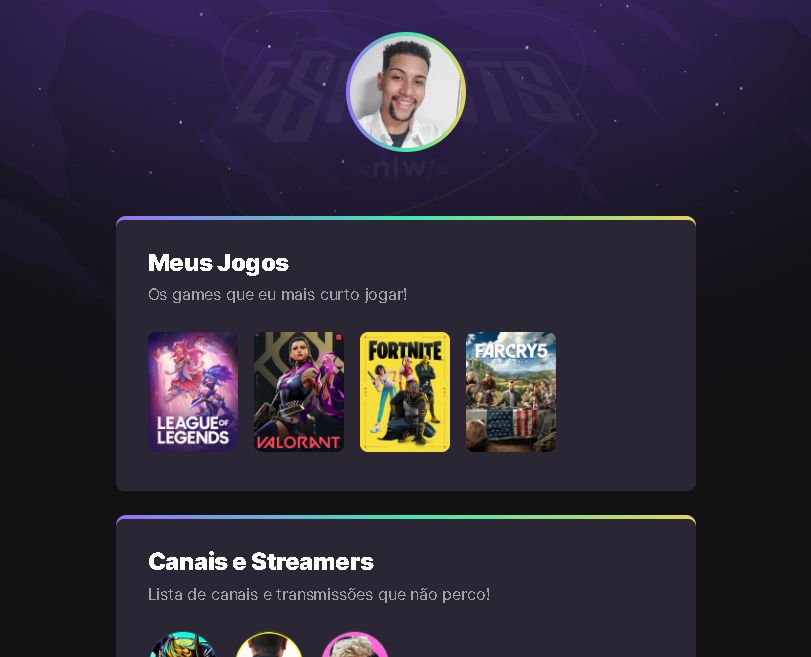

# NLW eSports - Trilha Explorer

> Trilha Explorer

Projeto construído do evento Next Level Week da Rocketseat

[Clique aqui para acessar](https://luckhenry.github.io/NLW-eSports--explorer/)

## Tecnologias

- HTML
- CSS
- GIT e Github

## O que aprendi 
Nessa semana intensa da Next Level Week - eSports, pude acessar um mundo totalmente diferente do qual estive inserido durante toda minha vida até agora. Foi uma semana incrível onde aprendi a trabalhar com HTML suas tags e elementos, aprendi a estilizar meu site utilizando CSS, aplicando cores, preenchimentos, bordas, margens, apliquei animações no CSS e finalizei o projeto entendendo mais sobre a funcionalidade do Github, e como ele é uma ferramenta muito importante no ambiente Dev! 

## Contato
rochalucassilva0@gmail.com